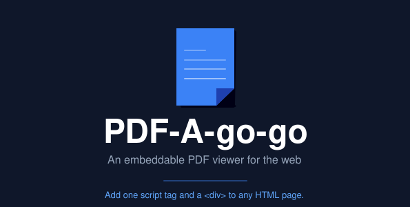

# PDF-A-go-go

[](https://github.com/khawkins98/PDF-A-go-go/actions)
[](https://github.com/khawkins98/PDF-A-go-go/issues)
[](LICENSE)

An embeddable PDF viewer for the web. Add one script tag and a `div` to any HTML page.



**[Try the live demo](https://www.allaboutken.com/PDF-A-go-go/)** | [Kitchen Sink](https://www.allaboutken.com/PDF-A-go-go/kitchen-sink.html) | [Large spread](https://www.allaboutken.com/PDF-A-go-go/double-spread.html#pdf-page-10) | [827-page stress test](https://www.allaboutken.com/PDF-A-go-go/stress-test-large-pdf.html)

## The problem

Embedding PDFs on the web is still surprisingly annoying. Browser `<iframe>` embeds look different everywhere and give you no control over the UI. Raw PDF.js gets you rendering, but you're writing hundreds of lines of setup code before you have anything usable. Most viewer libraries either require React or want you to pay for a hosted service.

If you just want to put a PDF on a web page with search, zoom, and keyboard nav, your options are thin.

## The fix

```html
<link rel="stylesheet" href="https://khawkins98.github.io/PDF-A-go-go/pdf-a-go-go.css" />
<script defer src="https://khawkins98.github.io/PDF-A-go-go/pdf-a-go-go.js"></script>

<div class="pdfagogo-container" data-pdf-url="./your-document.pdf"></div>
```

No init code, no build step. It reads `data-*` attributes off the container element and does the rest.

## How it compares

|                       | PDF-A-go-go | [EmbedPDF] | Raw PDF.js | `<iframe>` embed |
| --------------------- | :---------: | :--------: | :--------: | :--------------: |
| Lines to embed        |      3      |     3      |    200+    |        1         |
| Framework required    |     No      |     No     |     No     |        No        |
| Pinch-to-zoom         |     Yes     |    Yes     |    DIY     |     Browser      |
| Full-text search      |     Yes     |    Yes     |    DIY     |      Varies      |
| Annotations           |     No      |    Yes     |     No     |        No        |
| Memory efficient      |    ~8MB     |     ?      |   ~80MB    |       N/A        |
| Keyboard accessible   |     Yes     |    Yes     |    DIY     |        No        |
| Themeable             |  CSS vars   | Light/dark |    DIY     |        No        |
| Deep linking          |     Yes     |     No     |    DIY     |        No        |
| Multiple instances    |     Yes     |    Yes     |    DIY     |       Yes        |
| Transfer size         |   ~550 kB   |  ~2.3 MB   |   ~550 kB  |        0         |
| PDF engine            |   PDF.js    |   PDFium   |   PDF.js   |      Native      |

[EmbedPDF]: https://github.com/embedpdf/embed-pdf-viewer

### What PDF-A-go-go doesn't do

PDF-A-go-go is a read-only viewer. Editing features like **annotations** (highlights, sticky notes, ink, redaction) and **form filling** aren't something we're planning to add. If you need those, look at [EmbedPDF].

A few viewer features aren't supported yet but are on the radar:

- **Password-protected PDFs** -- PDF.js handles this under the hood, but the UI doesn't expose a password prompt yet.
- **i18n** -- the UI is English-only for now. Labels like "Search," "Download," and "Next page" are hardcoded.
- **Thumbnails** -- no sidebar of page previews. (Table-of-contents / outline navigation *is* supported: a toolbar toggle opens the PDF's outline when it has bookmarks.)
- **Page rotation and print** -- pages display as-is. For printing, users can download the PDF directly.

Browser-wise, PDF-A-go-go targets modern evergreen browsers. It won't work in IE11, and older mobile browsers (pre-2022) may have issues. See the [browser support table](#browser-support) in the details section below.

## Recipes

### Embed a PDF in a blog post

Paste this into your HTML:

```html
<link rel="stylesheet" href="https://khawkins98.github.io/PDF-A-go-go/pdf-a-go-go.css" />
<script defer src="https://khawkins98.github.io/PDF-A-go-go/pdf-a-go-go.js"></script>

<div class="pdfagogo-container" data-pdf-url="./report.pdf"></div>
```

### Open to a specific page with a toolbar

```html
<div class="pdfagogo-container"
  data-pdf-url="./handbook.pdf"
  data-default-page="5"
  data-show-search="true"
  data-show-page-selector="true"
  data-show-download="true"
  data-show-fullscreen="true"
  data-show-share="true"></div>
```

### Dark theme for a dashboard

```html
<div class="pdfagogo-container"
  data-pdf-url="./analytics.pdf"
  data-theme="dark"
  data-show-toolbar="true"></div>
```

### Multiple PDFs on the same page

Each viewer gets its own state, so zoom and search in one don't affect the other:

```html
<div class="pdfagogo-container" data-pdf-url="./chapter-1.pdf"></div>
<div class="pdfagogo-container" data-pdf-url="./chapter-2.pdf"></div>
```

### Link directly to a page

Append `#pdf-page-N` to any URL hosting the viewer and it'll open to that page:

```
https://yoursite.com/docs.html#pdf-page-42
```

<details>
<summary><strong>All configuration options</strong></summary>

Set options via `data-*` attributes on the container element:

| Attribute | Default | Description |
| --- | --- | --- |
| `data-pdf-url` | -- | PDF file URL (required) |
| `data-default-page` | `1` | Starting page number |
| `data-show-toolbar` | `true` | Show the toolbar |
| `data-show-search` | `true` | Show search controls |
| `data-show-outline` | `true` | Show the table-of-contents toggle (only appears if the PDF has bookmarks) |
| `data-show-share` | `true` | Show share button |
| `data-show-page-selector` | `true` | Show page selector |
| `data-show-current-page` | `true` | Show current page indicator |
| `data-show-download` | `true` | Show download button |
| `data-show-fullscreen` | `true` | Show fullscreen toggle |
| `data-show-resize-grip` | `true` | Show height resize handle |
| `data-show-accessibility-controls-visibly` | `false` | Show accessibility controls visually |
| `data-margin` | `1.0` | Page margin (rem) |
| `data-margin-top` | `0.5` | Top margin override (rem) |
| `data-margin-left` | `0.5` | Left margin override (rem) |
| `data-momentum` | `1.5` | Scroll momentum multiplier |
| `data-theme` | -- | Color theme (`dark` built-in, or custom) |
| `data-worker-url` | -- | Custom PDF.js worker URL |
| `data-fullpage-cache-size` | `10` | Full-page render cache size |
| `data-text-layer-cache-size` | `10` | Text layer cache size |
| `data-download-timeout` | `30000` | Download timeout (ms) |
| `data-disable-webgl` | `true` | Disable WebGL rendering |
| `data-debug` | `false` | Show performance overlay |

</details>

<details>
<summary><strong>Keyboard shortcuts</strong></summary>

| Shortcut | Action |
| --- | --- |
| Ctrl + Plus/Minus | Zoom in/out |
| Ctrl + 0 | Reset zoom to 100% |
| Ctrl + Scroll | Zoom with mouse wheel |
| Pinch gesture | Zoom on touch devices |

</details>

<details>
<summary><strong>Browser support</strong></summary>

| Browser | Minimum Version | Release Date | Limiting API |
| --- | --- | --- | --- |
| Chrome | 119+ | Oct 2023 | `Promise.withResolvers()` |
| Firefox | 124+ | Mar 2024 | `AbortSignal.any()` |
| Safari | 17.4+ | Mar 2024 | `Promise.withResolvers()`, `AbortSignal.any()` |
| Edge | 119+ | Nov 2023 | `Promise.withResolvers()` |
| iOS Safari | 17.4+ | Mar 2024 | `Promise.withResolvers()`, `AbortSignal.any()` |
| Android Chrome | 119+ | Oct 2023 | `Promise.withResolvers()` |
| Samsung Internet | 25+ | May 2024 | `Promise.withResolvers()` |

</details>

<details>
<summary><strong>Content Security Policy (CSP) recipe</strong></summary>

If your host page sets a CSP header, the viewer needs the following directives to load and render PDFs:

```
script-src 'self' blob:;
worker-src 'self' blob:;
connect-src 'self' https:;
img-src 'self' blob: data:;
style-src 'self' 'unsafe-inline';
```

Why each directive is needed:

- `worker-src` and `script-src` need `blob:` — PDF.js spawns its worker from a Blob URL when loading the worker script.
- `connect-src` needs whatever hosts you serve PDFs from. Use `'self'` if same-origin; add the explicit hostname for cross-origin.
- `img-src` needs `blob:` (rendered page tiles) and `data:` (icon spritesheet inlining in some build modes).
- `style-src 'unsafe-inline'` is currently required for the toolbar's inline style adjustments. Removing this is a known follow-up; see issue #17.

If you cannot allow `'unsafe-inline'` for styles in your environment, scope the viewer to a CSP-relaxed iframe that you embed into the strict-CSP host.

</details>

## Under the hood

Pages are divided into a grid of tiles, and only the ones currently visible get rendered. The resolution adapts to the zoom level, so you're not burning memory on 4x tiles for a page at 50% zoom. In practice this means ~8MB of memory for a large document instead of ~80MB with full-page rendering. Old tiles get evicted via an LRU cache.

More on [the motivation and design](https://www.allaboutken.com/posts/20250811-pdf-a-go-go/). Full architecture and API docs are in [DOCUMENTATION.md](DOCUMENTATION.md).

## See also

- **[PDF-A-go-slim](https://github.com/khawkins98/PDF-A-go-slim)** -- Optimize PDF file sizes before embedding. Useful for reducing transfer times when serving PDFs through PDF-A-go-go.

## Development

```bash
yarn install          # Install dependencies
yarn dev              # Start dev server (port 9000)
yarn build            # Production build to /dist
yarn test             # Run Playwright tests
```

### Git hooks

A tracked `commit-msg` hook in [`.githooks/`](.githooks/) rejects commit messages that contain AI/agent co-author trailers (e.g. `Co-authored-by: Claude`, Copilot, Cursor, Gemini, GPT/Codex) or machine-generated attribution lines (`Generated with`, `🤖 Generated`, `Written by …`). Matching is case-insensitive and deliberately narrow: genuine human co-authors are never blocked — including those with a `.ai` email domain — and ordinary prose like "generated with webpack" passes.

`yarn install` wires it up automatically via the `prepare` script (which runs `git config core.hooksPath .githooks`). You can also enable it manually:

```bash
git config core.hooksPath .githooks
```

Note: setting `core.hooksPath` makes git use only `.githooks`, so any personal hooks in `.git/hooks` (or Husky) won't run while it's configured.

## Credits

- [PDF.js](https://github.com/mozilla/pdf.js) -- Mozilla's PDF rendering library (Apache 2.0)
- [Lucide](https://lucide.dev) -- Icons (MIT)

## License

[MIT License](LICENSE)
